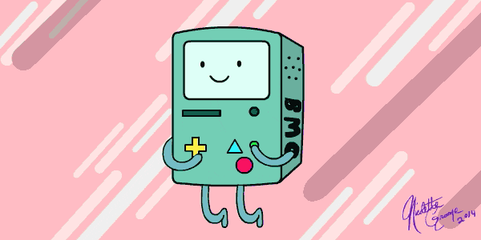

Hi I'm noirh8
==============================================================================================================================

Regular Student
---------------

I've enter university since 2022 and now I'm studying Computer Engineering

* 🌍  I'm based in Ho Chi Minh City
* ✉️  You can contact me at [hoang26644@gmail.com](mailto:hoang26644@gmail.com)
* 🧠  I'm learning C++, C, STM32, ...

### Skills

### Socials

 <a href="https://discord.com/users/noir0804" target="_blank" rel="noreferrer"> <picture> <source media="(prefers-color-scheme: dark)" srcset="undefined" /> <source media="(prefers-color-scheme: light)" srcset="https://raw.githubusercontent.com/danielcranney/readme-generator/main/public/icons/socials/discord.svg" />  </picture> </a> <a href="https://www.facebook.com/noir.h8" target="_blank" rel="noreferrer"> <picture> <source media="(prefers-color-scheme: dark)" srcset="https://raw.githubusercontent.com/danielcranney/readme-generator/main/public/icons/socials/facebook-dark.svg" /> <source media="(prefers-color-scheme: light)" srcset="https://raw.githubusercontent.com/danielcranney/readme-generator/main/public/icons/socials/facebook.svg" />  </picture> </a> <a href="https://www.github.com/noirh8" target="_blank" rel="noreferrer"> <picture> <source media="(prefers-color-scheme: dark)" srcset="https://raw.githubusercontent.com/danielcranney/readme-generator/main/public/icons/socials/github-dark.svg" /> <source media="(prefers-color-scheme: light)" srcset="https://raw.githubusercontent.com/danielcranney/readme-generator/main/public/icons/socials/github.svg" />  </picture> </a>

### Badges

<b>My GitHub Stats</b>

  &copy; 2023 Pham Dinh Bao Hoang  
  
  

